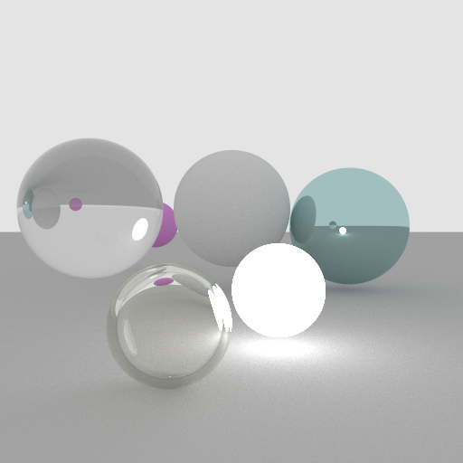

# Rustracer: A Raytracer Written in Rust

Rustracer is a toy project that I wrote to learn the basics of raytracing and Rust. It is a simple raytracer that renders a scene with a camera and a light. This code is not intended to be a production-ready raytracer, but it is a good starting point for learning the basics of raytracing.